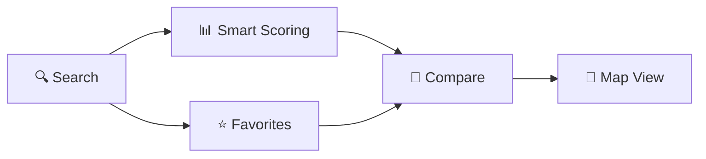
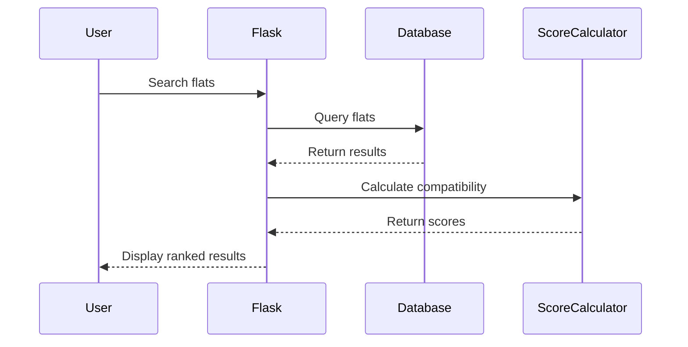

# 🏠 HDB Resale Flat Finder

> A smart Flask web application for searching and comparing HDB resale flats in Singapore with personalized compatibility scoring.

[](https://www.python.org/)
[](https://flask.palletsprojects.com/)
[](LICENSE)

## ✨ Features



- **Smart Search** - Filter by town, flat type, and keywords with pagination
- **Personalized Scoring** - AI-powered compatibility scores based on your preferences
- **Favorites System** - Save and manage your preferred properties
- **Side-by-Side Comparison** - Compare two flats with detailed metrics
- **Interactive Maps** - Visualize locations with Google Maps integration

## 🚀 Quick Start

### Prerequisites
- Python 3.8+
- Google Maps API key ([Get one here](https://developers.google.com/maps/documentation/javascript/get-api-key))

### Installation

```bash
# 1. Install dependencies
pip install -r requirements.txt

# 2. Fetch HDB data (this may take a few minutes)
python dataPrepare.py

# 3. Set your Google Maps API key
export GOOGLE_MAPS_API_KEY="your-api-key-here"

# 4. Run the application
python app.py
```

🌐 Open **http://127.0.0.1:5000** in your browser

## 📁 Architecture

```
┌─────────────────┬──────────────────────────────────────┐
│ Component       │ Description                          │
├─────────────────┼──────────────────────────────────────┤
│ app.py          │ Flask routes & application logic     │
│ Database.py     │ SQLite database operations           │
│ scoreCalculator │ Compatibility scoring algorithm      │
│ Userpreferences │ User preferences management          │
│ dataPrepare.py  │ Data ingestion from gov.sg API       │
├─────────────────┼──────────────────────────────────────┤
│ templates/      │ Jinja2 HTML templates                │
│ static/         │ CSS & JavaScript assets              │
└─────────────────┴──────────────────────────────────────┘
```

## 🎯 How It Works



## 🛠️ Tech Stack

| Layer      | Technology |
|------------|------------|
| Backend    | Flask, Python 3.8+ |
| Database   | SQLite |
| Frontend   | HTML5, CSS3, JavaScript |
| Data Source| data.gov.sg API |
| Maps       | Google Maps API |

## 📊 Key Routes

| Route | Description |
|-------|-------------|
| `/` | Home & search interface |
| `/search` | Search results with pagination |
| `/flat/<id>` | Detailed flat information |
| `/preferences` | Set search preferences |
| `/favorites` | View saved flats |
| `/compare/<id1>/<id2>` | Compare two flats |

## 🔧 Configuration

Set preferences to get personalized compatibility scores:
- Flat type (e.g., 3 ROOM, 4 ROOM)
- Storey range
- Floor area
- Flat model
- Price range

## 📝 License

MIT License - feel free to use this project for learning and development.

---

**Note:** This is a demo application for educational purposes. HDB data is fetched from Singapore's open data portal.
