# 🏠 HDB Resale Flat Finder

> A smart Flask web application for searching and comparing HDB resale flats in Singapore with personalized compatibility scoring.

[](https://www.python.org/)
[](https://flask.palletsprojects.com/)
[](LICENSE)

## ✨ Features

```mermaid
graph LR
    A[🔍 Search] --> B[📊 Smart Scoring]
    A --> C[⭐ Favorites]
    B --> D[🔄 Compare]
    C --> D
    D --> E[📍 Map View]
    A --> F[🤖 AI Assistant]
    F --> B
```



- **Smart Search** - Filter by town, flat type, and keywords with pagination
- **🤖 AI Assistant with RAG** - Chat with an intelligent assistant that retrieves data from the database and provides personalized insights using Google Gemini API
- **Personalized Scoring** - AI-powered compatibility scores based on your preferences
- **Favorites System** - Save and manage your preferred properties
- **Side-by-Side Comparison** - Compare two flats with detailed metrics and AI analysis
- **Interactive Maps** - Visualize locations with Google Maps integration
- **AI Property Analysis** - Get detailed AI-powered analysis for any property

## 🚀 Quick Start

### Prerequisites
- Python 3.8+
- Google Maps API key ([Get one here](https://developers.google.com/maps/documentation/javascript/get-api-key))
- **Gemini API key** for AI Assistant ([Get one here](https://makersuite.google.com/app/apikey))

### Installation

```bash
# 1. Install dependencies
pip install -r requirements.txt

# 2. Fetch HDB data (this may take a few minutes)
python dataPrepare.py

# 3. Set your API keys
# Google Maps API key
export GOOGLE_MAPS_API_KEY="your-google-maps-api-key-here"

# Gemini API key (for AI Assistant)
export GEMINI_API_KEY="your-gemini-api-key-here"

# 4. Test the AI Assistant (optional)
python test_ai_assistant.py

# 5. Run the application
python app.py
```

🌐 Open **http://127.0.0.1:5000** in your browser

💬 Try the AI Assistant at **http://127.0.0.1:5000/ai_chat**

## 📁 Architecture

```
┌─────────────────┬──────────────────────────────────────┐
│ Component       │ Description                          │
├─────────────────┼──────────────────────────────────────┤
│ app.py          │ Flask routes & application logic     │
│ ai_assistant.py │ AI Assistant with RAG using Gemini   │
│ Database.py     │ SQLite database operations           │
│ scoreCalculator │ Compatibility scoring algorithm      │
│ Userpreferences │ User preferences management          │
│ dataPrepare.py  │ Data ingestion from gov.sg API       │
├─────────────────┼──────────────────────────────────────┤
│ templates/      │ Jinja2 HTML templates                │
│   ai_chat.html  │ AI Assistant chat interface          │
│ static/         │ CSS & JavaScript assets              │
└─────────────────┴──────────────────────────────────────┘
```

## 🎯 How It Works


## 🛠️ Tech Stack

| Layer      | Technology |
|------------|------------|
| Backend    | Flask, Python 3.8+ |
| AI         | Google Gemini API, RAG |
| Database   | SQLite |
| Frontend   | HTML5, CSS3, JavaScript |
| Data Source| data.gov.sg API |
| Maps       | Google Maps API |

## 📊 Key Routes

| Route | Description |
|-------|-------------|
| `/` | Home & search interface |
| `/search` | Search results with pagination |
| `/flat/<id>` | Detailed flat information |
| `/preferences` | Set search preferences |
| `/favorites` | View saved flats |
| `/compare/<id1>/<id2>` | Compare two flats |
| `/ai_chat` | 🤖 AI Assistant chat interface |
| `/api/ai/chat` | AI chat API endpoint (POST) |
| `/api/ai/analyze_flat/<id>` | Get AI analysis for a flat (GET) |
| `/api/ai/compare/<id1>/<id2>` | Get AI comparison of two flats (GET) |

## 🔧 Configuration

Set preferences to get personalized compatibility scores:
- Flat type (e.g., 3 ROOM, 4 ROOM)
- Storey range
- Floor area
- Flat model
- Price range

### 🤖 AI Assistant Features

The AI Assistant uses **RAG (Retrieval-Augmented Generation)** to provide intelligent responses:

1. **Intelligent Search**: Ask natural language questions like "Show me affordable flats in Tampines"
2. **Data-Driven Insights**: AI retrieves relevant data from the database before answering
3. **Property Analysis**: Get detailed AI analysis of any property
4. **Comparison**: Compare properties with AI-powered insights
5. **Conversation History**: Maintains context across multiple questions

**Example Questions:**
- "What are the most affordable 4-room flats in Bedok?"
- "Compare prices between Bishan and Ang Mo Kio"
- "Tell me about properties under $500,000"
- "Which area is best for families?"

## 📝 License

MIT License - feel free to use this project for learning and development.

---

**Note:** This is a demo application for educational purposes. HDB data is fetched from Singapore's open data portal.


```mermaid
flowchart LR
  subgraph Client
    Browser[Browser\n(Jinja2 pages, JavaScript UI)]
  end

  subgraph Backend
    Flask[Flask app (app.py)\nHTTP routes & REST APIs]
    Score[scoreCalculator.py\nCompatibility logic]
    Prefs[Userpreferences.py\nUser prefs]
    DBWrapper[Database.py\nSQLite wrapper]
    DataPrep[dataPrepare.py\nData ingestion]
    AIService[ai_assistant.py\nRAG + Gemini API]
  end

  subgraph External
    Gemini[Google Gemini API\n(Generative)]
    Maps[Google Maps API]
    HDBSource[data.gov.sg\nHDB Resale API]
  end

  Browser -->|renders/form requests| Flask
  Browser -->|Google Maps requests (client)| Maps

  Flask -->|queries| DBWrapper
  Flask -->|score requests| Score
  Flask -->|preference calls| Prefs

  Flask -->|AI endpoints (/api/ai/*)| AIService
  AIService -->|retrieval| DBWrapper
  AIService -->|generate| Gemini

  DataPrep -->|fetch & write| DBWrapper
  DataPrep -->|source| HDBSource

  note right of Flask
    Key endpoints:
    - /api/ai/chat (POST)
    - /api/ai/analyze_flat/:id (GET)
    - /api/ai/compare/:id1/:id2 (GET)
    - /preferences, /favorites, /compare/:id1/:id2
  endnote

  style Client fill:#f9f,stroke:#333,stroke-width:1px
  style Backend fill:#efe,stroke:#333,stroke-width:1px
  style External fill:#eef,stroke:#333,stroke-width:1px
```
